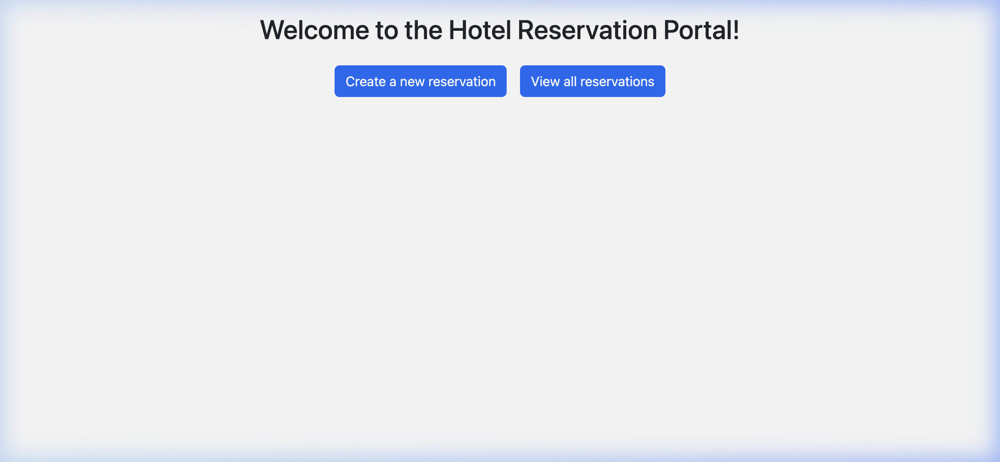
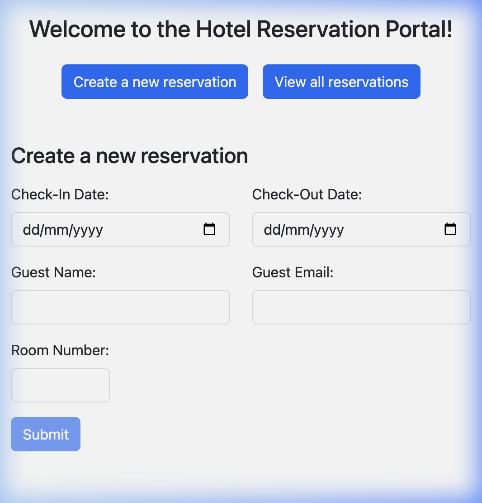
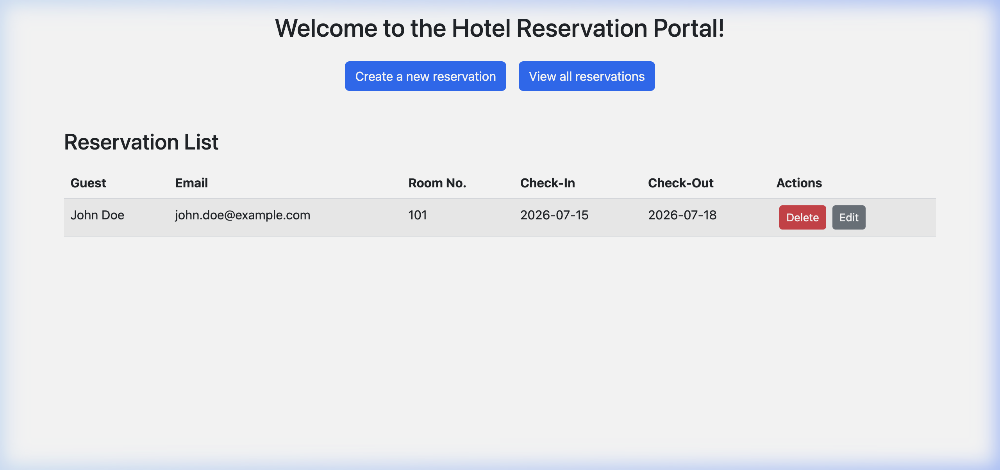

<div align="center">

<br>
<br>
<br>


<br>
<br>

# Hotel Appointment System

<br>

<p>
<samp>A modern Hotel Reservation & Appointment Management System<br>built with Angular 16, TypeScript, and Bootstrap 5.</samp>
</p>

<p>
<samp>Designed for fast booking, seamless reservation management,<br>and an exceptional user experience.</samp>
</p>

<br>

<a href="https://github.com/srjay999-giT/hotel-appointment-system/stargazers">

</a>
&nbsp;
<a href="https://github.com/srjay999-giT/hotel-appointment-system/network/members">

</a>
&nbsp;
<a href="https://github.com/srjay999-giT/hotel-appointment-system/issues">

</a>
&nbsp;

&nbsp;


<br>
<br>
<br>


&nbsp;

&nbsp;

&nbsp;


<br>


&nbsp;

&nbsp;

&nbsp;


<br>
<br>
<br>
<br>

<a href="https://github.com/srjay999-giT/hotel-appointment-system">

</a>
&nbsp;&nbsp;&nbsp;
<a href="https://hotel-app-eta-sooty.vercel.app">

</a>
&nbsp;&nbsp;&nbsp;
<a href="#-getting-started">

</a>

<br>
<br>
<br>

</div>

---

<br>

<div align="center">

<h2>Preview</h2>

<br>



<br>
<br>

<sub>The landing page of the Hotel Appointment System — clean navigation to create or view reservations.</sub>

</div>

<br>
<br>

---

<br>

## ✨ Features

<br>

<table>
<tr>
<td width="50%" valign="top">

<br>

### 📋 &nbsp; Reservation Management

Full CRUD operations for managing hotel reservations with persistent storage.

<br>

&nbsp;&nbsp;&nbsp; ✅ &nbsp; Create new guest reservations<br>
&nbsp;&nbsp;&nbsp; ✅ &nbsp; View all reservations in a sortable table<br>
&nbsp;&nbsp;&nbsp; ✅ &nbsp; Edit existing reservation details<br>
&nbsp;&nbsp;&nbsp; ✅ &nbsp; Delete reservations with one click<br>
&nbsp;&nbsp;&nbsp; ✅ &nbsp; Data persists across browser sessions<br>

<br>

</td>
<td width="50%" valign="top">

<br>

### 🎨 &nbsp; Modern User Interface

Responsive, mobile-friendly design powered by Bootstrap 5.3.

<br>

&nbsp;&nbsp;&nbsp; ✅ &nbsp; Clean, minimal layout<br>
&nbsp;&nbsp;&nbsp; ✅ &nbsp; Responsive on all screen sizes<br>
&nbsp;&nbsp;&nbsp; ✅ &nbsp; Bootstrap 5 component library<br>
&nbsp;&nbsp;&nbsp; ✅ &nbsp; Intuitive navigation flow<br>
&nbsp;&nbsp;&nbsp; ✅ &nbsp; Professional table presentation<br>

<br>

</td>
</tr>
<tr>
<td width="50%" valign="top">

<br>

### ⚡ &nbsp; Smart Forms

Angular Reactive Forms with real-time field validation.

<br>

&nbsp;&nbsp;&nbsp; ✅ &nbsp; Reactive form architecture<br>
&nbsp;&nbsp;&nbsp; ✅ &nbsp; Required field validation<br>
&nbsp;&nbsp;&nbsp; ✅ &nbsp; Email format validation<br>
&nbsp;&nbsp;&nbsp; ✅ &nbsp; Inline error messages<br>
&nbsp;&nbsp;&nbsp; ✅ &nbsp; Pre-populated edit forms<br>

<br>

</td>
<td width="50%" valign="top">

<br>

### 🏗️ &nbsp; Solid Architecture

Modular Angular architecture with clean separation of concerns.

<br>

&nbsp;&nbsp;&nbsp; ✅ &nbsp; Feature-based module structure<br>
&nbsp;&nbsp;&nbsp; ✅ &nbsp; Centralized service layer<br>
&nbsp;&nbsp;&nbsp; ✅ &nbsp; TypeScript interfaces for type safety<br>
&nbsp;&nbsp;&nbsp; ✅ &nbsp; Angular Router with parameterized routes<br>
&nbsp;&nbsp;&nbsp; ✅ &nbsp; Reusable shared components<br>

<br>

</td>
</tr>
</table>

<br>
<br>

---

<br>

## 🏛️ Architecture

<br>

```
src/
│
├── app/
│   │
│   ├── home/                              # Landing Page
│   │   ├── home.component.ts              
│   │   ├── home.component.html            # Welcome view with navigation
│   │   ├── home.component.css             
│   │   └── home.module.ts                 # Home feature module
│   │
│   ├── models/                            # Data Layer
│   │   └── reservation.ts                 # Reservation interface
│   │
│   ├── reservation/                       # Core Service
│   │   ├── reservation.service.ts         # CRUD operations + localStorage
│   │   └── reservation.module.ts          # Reservation feature module
│   │
│   ├── reservation-form/                  # Create & Edit
│   │   ├── reservation-form.component.ts  # Reactive form logic
│   │   ├── reservation-form.component.html# Form template with validation
│   │   └── reservation-form.component.css 
│   │
│   ├── reservation-list/                  # List & Delete
│   │   ├── reservation-list.component.ts  # Table + delete logic
│   │   ├── reservation-list.component.html# Data table template
│   │   └── reservation-list.component.css 
│   │
│   ├── app-routing.module.ts              # Route definitions
│   ├── app.component.ts                   # Root component
│   ├── app.component.html                 # Router outlet
│   └── app.module.ts                      # Root module
│
├── assets/                                # Static assets
├── index.html                             # Application shell
├── main.ts                                # Bootstrap entry point
└── styles.css                             # Global styles + Bootstrap
```

<br>
<br>

---

<br>

## 🛠 Tech Stack

<br>

<div align="center">

| Technology | Version | Purpose |
|:---:|:---:|:---|
|  | `16.1` | Frontend framework — component architecture, routing, DI |
|  | `5.1` | Type-safe development with interfaces and strict typing |
|  | `5.3` | Responsive UI components, grid system, and utilities |
|  | `7.8` | Reactive programming for async data streams |
|  | `5` | Semantic markup and application structure |
|  | `3` | Custom styling and layout |
|  | — | Client-side data persistence across sessions |
|  | `6.4` | Unit test runner |

</div>

<br>
<br>

---

<br>

## 📸 Screenshots

<br>

<div align="center">

<table>
<tr>
<td align="center" width="50%">

<br>

**Booking Form**



<sub>Create new reservations with validated form fields</sub>

<br>
<br>

</td>
<td align="center" width="50%">

<br>

**Reservation List**



<sub>View, edit, and delete reservations from a clean table</sub>

<br>
<br>

</td>
</tr>
</table>

</div>

<br>
<br>

---

<br>

## 📌 Routes

<br>

<div align="center">

| Route | Page | Description |
|:---|:---|:---|
| `/` | Home | Welcome page with navigation to all features |
| `/new` | Create | Reservation booking form with validation |
| `/list` | List | View all reservations with edit and delete |
| `/edit/:id` | Edit | Pre-populated form to update a reservation |

</div>

<br>
<br>

---

<br>

## 🚀 Getting Started

<br>

### Prerequisites

<br>

```
Node.js     v16 or higher
Angular CLI v16.1.6
npm         v8+
```

<br>

### Installation

<br>

**1. Clone the repository**

```bash
git clone https://github.com/srjay999-giT/hotel-appointment-system.git
```

<br>

**2. Navigate to the project**

```bash
cd hotel-appointment-system
```

<br>

**3. Install dependencies**

```bash
npm install
```

<br>

**4. Start the development server**

```bash
npm start
```

<br>

**5. Open in your browser**

```
http://localhost:4200
```

<br>
<br>

---

<br>

## 🧪 Testing

<br>

```bash
# Run unit tests via Karma
npm test
```

```bash
# Build for production
ng build --configuration production
```

<br>
<br>

---

<br>

## 🗺️ Roadmap

<br>

Planned features and improvements for future releases.

<br>

- [ ] &nbsp; 🌙 &nbsp; Dark mode theme toggle
- [ ] &nbsp; 📧 &nbsp; Email confirmation notifications
- [ ] &nbsp; 📊 &nbsp; Admin dashboard with analytics
- [ ] &nbsp; 🔐 &nbsp; Role-based authentication (Admin / Guest)
- [ ] &nbsp; 💳 &nbsp; Payment gateway integration
- [ ] &nbsp; 📅 &nbsp; Room availability calendar view
- [ ] &nbsp; 🔥 &nbsp; Firebase backend integration
- [ ] &nbsp; 🧩 &nbsp; Migration to Angular standalone components
- [ ] &nbsp; 🌍 &nbsp; Multi-language support (i18n)

<br>
<br>

---

<br>

## 👨‍💻 Developer

<br>

<div align="center">

<br>

<a href="https://github.com/srjay999-giT">

</a>

<br>
<br>

<p><samp>Built with focus and passion for clean code.</samp></p>

<br>

<a href="https://github.com/srjay999-giT">

</a>

<br>
<br>

</div>

<br>

---

<br>

<div align="center">

<br>

<samp>

**Built with [Angular](https://angular.io) ❤️**

</samp>

<br>

<a href="#hotel-appointment-system">

</a>

<br>
<br>
<br>

</div>
